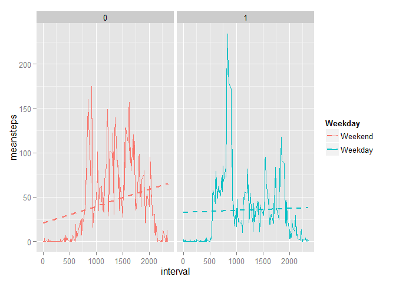

# Reproducible Research: Peer Assessment 1
This peer-assessed work is part of the evaluation for the 'Reproducible Research' MOOC.

This assignment makes use of data from a personal activity monitoring device. This device collects data at 5 minute intervals through out the day. The data consists of two months of data from an anonymous individual collected during the months of October and November, 2012 and include the number of steps taken in 5 minute intervals each day.

The questions that this analysis aims to answer are:

1. What's the mean steps per day?
2. What's the avg daily activity pattern?
3. How could we impute missing values?
4. Are the activity patterns during weekdays from weekends?

## Loading and preprocessing the data
A good practice is to make sure input data files are there, and if not, download them. We're not showing results here for convenience reasons. We're also converting the date column of type character to POSIX with format 'year-month-day'.


```r
options(scipen = 1, digits = 2) # Set scientific notation digits

# Load required libraries
if (!require(lubridate)) {stop('Package lubridate must be installed before proceeding.')}
if (!require(dplyr)) {stop('Package dplyr must be installed before proceeding.')}
if (!require(ggplot2)) {stop('Package ggplot2 must be installed before proceeding.')}
if (!require(gridExtra)) {stop('Package gridExtra must be installed before proceeding.')}

# Download and process data
downloadedFilename <- 'activity.zip'
dataFilename <- 'activity.csv'
if (!file.exists(dataFilename)) {
    dataUrl <- paste('https://d396qusza40orc.cloudfront.net/repdata/data/',downloadedFilename, sep = '')
    download.file(dataUrl, destfile = downloadedFilename)
    unzip(downloadedFilename, files = dataFilename)
}

activity <- read.csv('activity.csv', stringsAsFactors = F, 
                     colClasses = c('numeric', 'character', 'numeric'))

# Convert date from character to posix
activity <- activity %>% mutate(date=ymd(date))
```


## What is mean total number of steps taken per day?
For this exercise the data were grouped by date, then a histogram was plotted. Vertical lines were added at the mean and median values:

```r
steps <- activity %>% group_by(date) %>% summarise(totalsteps=sum(steps, na.rm = T))

# Median and mean
meansteps <- mean(steps$totalsteps, na.rm = T)
mediansteps <- median(steps$totalsteps, na.rm = T)

# save plot in hist1
hist1 <- ggplot(aes(x=totalsteps), data=steps) + 
  geom_histogram(fill='blue', col='black', binwidth=800, show_guide=TRUE) + 
  geom_vline(data=steps, aes(xintercept=meansteps), color='red') + 
  geom_vline(data=steps, aes(xintercept=mediansteps), color='#009900') +
  labs(x='Total steps measured each day (bin=800 steps)', 
      y='Number of days with X step count', 
      title='Frequency of total steps measured each day') +
  annotate('text', label=paste('Mean=',round(meansteps,2)), x=meansteps - 4000, y=10, color='red') +
  annotate('text', label=paste('Median=',mediansteps), x=mediansteps + 4000, y=10, color='#009900')

# plot hist1
plot(hist1)
```

 

From the histogram we can conclude:

* There are a little under 10 days with 0 steps.
* The distribution is skewed to the right.
* This skewness usually causes the mean to be greater than the median, but in this case, the outlier at 0 steps pulls the mean to the left.

Finally, the mean and median around the central tendency of the distribution are **9354.23** and **10395**, respectively.

## What is the average daily activity pattern?

1. Make a time series plot (i.e. type = "l") of the 5-minute interval (x-axis) and the average number of steps taken, averaged across all days (y-axis)

2. Which 5-minute interval, on average across all the days in the dataset, contains the maximum number of steps?

```r
ts <- activity %>% group_by(interval) %>% summarise(meansteps=mean(steps, na.rm = T))
ggplot(data=ts, aes(x=interval, y=meansteps)) + 
  geom_line(color='blue', lwd=1) +
  geom_smooth(lty=2, method='lm') +
  labs(x='5-min interval throughout all days', y='Average steps measured', title='Average steps for all 5-min intervals throughout all days') 
```

 

```r
# Obtain interval with maximum avg of steps
maxinterval <- ts[which(ts$meansteps==max(ts$meansteps)),]
```
From the graph we conclude that the measured physical activity starts at around the 530 mark, which roughly corresponds to 5:30am, and it peaks at interval **835**, which is around 8:30am mark with **206.17** steps. This could mean, if you wish to further hypothesize, that the time of greater activity can be due to members of the study doing their work commute.

## Imputing missing values

1. Calculate and report the total number of missing values in the dataset (i.e. the total number of rows with NAs)

The only variable with NAs in their measurements is *steps*. The other variables, being categories of the measurement, are all complete. There are:

```r
sum(is.na(activity$steps))
```

```
## [1] 2304
```
rows with NA in variable *steps*.

2. Devise a strategy for filling in all of the missing values in the dataset. The strategy does not need to be sophisticated. For example, you could use the mean/median for that day, or the mean for that 5-minute interval, etc.

3. Create a new dataset that is equal to the original dataset but with the missing data filled in.

The strategy is to calculate the mean for each interval for all days, and replace the NA with such mean for that particular interval.


```r
# clone original data frame activity and store it in 'impute' variable
imputed <- activity

# create new column 'mean' obtained from ts dataframe created in chunk code from previous question 
imputed <- inner_join(x = imputed, y = ts, by = c('interval'='interval'))

# assign meansteps value to NA values in 'steps' column
imputed$steps <- ifelse(is.na(imputed$steps), imputed$meansteps, imputed$steps)

# verify there are no NAs left
sum(is.na(imputed$steps))
```

```
## [1] 0
```

```r
# print head of 'imputed' to show there are no NAs left
head(imputed)
```

```
##   steps       date interval meansteps
## 1 1.717 2012-10-01        0     1.717
## 2 0.340 2012-10-01        5     0.340
## 3 0.132 2012-10-01       10     0.132
## 4 0.151 2012-10-01       15     0.151
## 5 0.075 2012-10-01       20     0.075
## 6 2.094 2012-10-01       25     2.094
```
The strategy was implemented using the data frame 'ts' from previous question, since it already has the means for each interval for all days. It is then just a matter of joining the copy of original data frame, the data frame with means for each interval, and replacing each NA in 'steps' for the mean in column 'meansteps'.

4. Make a histogram of the total number of steps taken each day and Calculate and report the mean and median total number of steps taken per day. Do these values differ from the estimates from the first part of the assignment? What is the impact of imputing missing data on the estimates of the total daily number of steps?

```r
# Summarize IMPUTED data
imputedsteps <- imputed %>% group_by(date) %>% summarise(totalsteps=sum(steps, na.rm = T))

# Median and mean of IMPUTED data
meanimputedsteps <- mean(imputedsteps$totalsteps, na.rm = T)
medianimputedsteps <- median(imputedsteps$totalsteps, na.rm = T)

# Build plot
hist2 <- ggplot(aes(x=totalsteps), data=imputedsteps) + 
  geom_histogram(fill='blue', col='black', binwidth=800, show_guide=TRUE) + 
  geom_vline(data=imputedsteps, aes(xintercept=meanimputedsteps), color='red') + 
  geom_vline(data=imputedsteps, aes(xintercept=medianimputedsteps), color='#009900') +
  labs(x='Total steps measured each day (bin=800 steps)', 
      y='Number of days with X step count', 
      title='Frequency of total steps measured each day') +
  annotate('text', label=paste('Mean=',round(meanimputedsteps,2)), x=meanimputedsteps - 7000, y=10, color='red') +
  annotate('text', label=paste('Median=',round(medianimputedsteps,2)), x=medianimputedsteps + 7000, y=10, color='#009900')

# Plot
grid.arrange(hist1,hist2, ncol=2, main='Comparison of histograms for original data (left) and imputed data (right)')
```

 

These are the interesting observations of both imputed and original data and their plots, given the imputing strategy devised:

1. The distribution is now closer to being symmetrical.
2. THe outliers in frequency at 0 were shifted towards the mean.
3. Therefore, the frequency of step counts around 1000 has increased from a little over 7.5 to well above 13.
4. Mean and median are now equal.
5. Therefore, and given that no data in the real world is as neatly laid out as the imputed data, we can surmise the imputing strategy will introduce white noise such that the distribution will be close to normal.

## Are there differences in activity patterns between weekdays and weekends?


```r
activity$weekday <- ifelse(wday(activity$date) %in% c(6,7), 0,1)

differences <- summarise(group_by(activity, weekday, interval), meansteps=mean(steps, na.rm=T))

ggplot(differences, aes(x=interval, y=meansteps, group=weekday, color=factor(weekday))) +
  geom_line() +
  geom_smooth(method="lm", se=FALSE, lty=2, lwd=1) +
  scale_color_discrete(name="Weekday",
                         labels=c("Weekend", "Weekday"))
```

 

This comparison was constructed by taking the mean steps for all weekdays and weekends grouped by interval of the original data (not the imputed one) and following the notion of weekday and weekend activity of a hypothetical human.

From the chart it is somewhat difficult to conclude something about the actual pattern, but upon closer inspection and addition of trend lines, it is very clear that during weekends the activity almost stays flat compared to weekdays.
